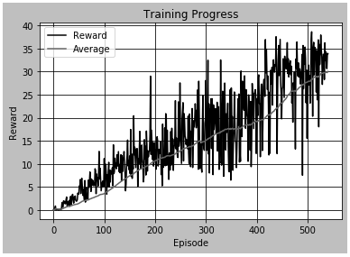

# Project 2: Continuous Control - Report

## Environment
In this environment, a double-jointed arm can move to target locations.

## Goal
The goal of agent is to maintain its position at the target location for as many time steps as possible.

## Other environment info
**Reward:** +0.1 _(For each step that the agent's hand is in the goal location.)_
**Possible Actions:** 4 _(Every entry in the action vector should be a number between -1 and 1.)_
**Available States:** 33 _(Corresponding to position, rotation, velocity, and angular velocities of the arm)_

## Solution
The environment is solved with DDPG algorithm _([Continuous control with deep reinforcement learning - arXiv:1509.02971 [cs.LG]](https://arxiv.org/pdf/1509.02971.pdf))_

### Model Architecture
As per the DDPG paper, four networks were used:
    1. Actor (Local)
    2. Critic (Local)
    3. Actor (Target)
    4. Critic (Target)

Below are the structures for #1 and #3 (Actor):
```
Actor(
  (inp): Linear(in_features=33, out_features=330, bias=True)
  (h1): Linear(in_features=330, out_features=160, bias=True)
  (out): Linear(in_features=160, out_features=4, bias=True)
)
```

Below are the structures for #2 and #4 (Critic):
```
Critic(
  (inp): Linear(in_features=33, out_features=330, bias=True)
  (h1): Linear(in_features=334, out_features=160, bias=True)
  (out): Linear(in_features=160, out_features=1, bias=True)
)
```
<sub>Actions (4) were added to hidden layer as per DDPG paper</sub>

### Hyper Parameters 
Below hyper parameters were used:

```
SEED                = 2020
REPLAY_BUFFER_SIZE  = 1e+6
ACTOR_LR            = 1e-4
CRITIC_LR           = 1e-4 # DDPG Paper = 1e-3
GAMMA               = 0.99
TAU                 = 1e-3
BATCH_SIZE          = 64   # DDPG Paper = 32
WEIGHT_DECAY        = 0    # DDPG Paper = 1e-2
Hidden Network Nodes = [330, 160] # DDPG Paper = [400, 300]
```

### Training Progress

```
  100/1000: Score = 5.32 << Last 100 Avg = 3.49, Max Avg = 3.49 >> Time Elapsed = 0:10:56.082118    Models saved.
  200/1000: Score = 14.60 << Last 100 Avg = 10.64, Max Avg = 10.64 >> Time Elapsed = 0:22:03.241901    Models saved.
  300/1000: Score = 19.76 << Last 100 Avg = 15.00, Max Avg = 15.02 >> Time Elapsed = 0:33:54.867657    Models saved.
  400/1000: Score = 12.26 << Last 100 Avg = 19.22, Max Avg = 19.29 >> Time Elapsed = 0:46:49.465486    Models saved.
  500/1000: Score = 15.53 << Last 100 Avg = 27.71, Max Avg = 27.71 >> Time Elapsed = 1:00:22.775709    Models saved.
  541/1000: Score = 33.88 << Last 100 Avg = 30.05, Max Avg = 30.05 >> Time Elapsed = 1:05:55.636624    

Solved in 541 episodes - Received an average score of 30.05 in last 100

Training completed. Model saved to reacher.ckpt
```

### Training Progress - Plot of Rewards


### Checkpoints
After every 100 steps, model weights were saved to corresponding files for all four networks.
Checkpoint was also saved at the end of training. This final version of checkpoint file can be used for inspecting the agent performance.

### Agent in action - Loaded from checkpoints


### Hyper Parameter Tuning
As you may notice, some of the hyper parameters were modified from the original paper. 
This was due to the very low performance observed with values shared in the original paper.
Please see below for more information

#### Hyper Params from Paper

```
SEED                 = 2020
REPLAY_BUFFER_SIZE   = 1e+6
ACTOR_LR             = 1e-4
CRITIC_LR            = 1e-3
GAMMA                = 0.99
TAU                  = 1e-3
BATCH_SIZE           = 32
WEIGHT_DECAY         = 1e-2
Hidden Network Nodes = [400, 300]
```
#### Hyper Params from Paper - Training Progress

```
  100/1000: Score = 1.87 << Last 100 Avg = 0.72, Max Avg = 0.72 >> Time Elapsed = 0:11:08.855473    Models saved.
  200/1000: Score = 0.89 << Last 100 Avg = 0.85, Max Avg = 0.87 >> Time Elapsed = 0:22:58.261073    Models saved.
  300/1000: Score = 1.40 << Last 100 Avg = 0.82, Max Avg = 0.88 >> Time Elapsed = 0:34:33.127861    Models saved.
  400/1000: Score = 0.71 << Last 100 Avg = 0.85, Max Avg = 0.88 >> Time Elapsed = 0:46:25.556855    Models saved.
  500/1000: Score = 1.00 << Last 100 Avg = 0.91, Max Avg = 0.92 >> Time Elapsed = 0:58:32.486274    Models saved.
  521/1000: Score = 0.16 << Last 100 Avg = 0.90, Max Avg = 0.93 >> Time Elapsed = 1:01:05.881151   
```
<sub>*Stopped after an hour for a better comparison with above data</sub>

As you can see, the training was very slow and almost _stagnant after 100+_ episodes.

<!-- #### Hyper Params from Paper - Training Progress Plot


<sub>*Stopped after an hour for a better comparison with above data</sub> -->

### Ideas for Future Work
* Further Hyper parameter tuning may yeild faster training time.
* DDPG Paper has references to batch normalization, it is not implemented in full in current model
* Parallel training could be attempted (Version 2 in original project instructions)
* Other RL algorithms such as A3C could be used for solving the problem

